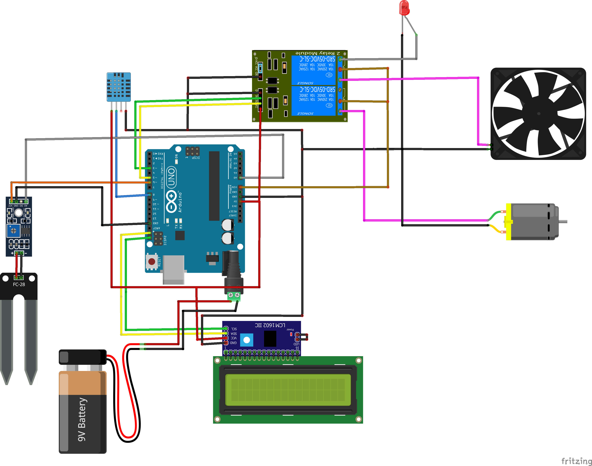

# Project Agroteknologi to Workshop PSMURO (Pusat Studi Multimedia dan Robotika) Universitas Gunadarma

## Weather and Soil Moisture Monitoring System to Agriculture

### Overview

- This project uses an ESP8266 Wemos D1 R1 microcontroller to monitor environmental conditions using a DHT11 sensor for temperature and humidity, and a soil moisture sensor. The data collected from these sensors is sent to ThingSpeak, an IoT platform that provides real-time data visualization.

### Components Required

- ESP8266 (Wemos D1 R1) = 1 unit;
- DHT11 Sensor: (Measures temperature and humidity) = 1 unit;
- Soil Moisture Sensor (Type Df-robot or FC-28) = 1 unit;
- Relay Module 2 Channel: (Controls the operation of lamps, fans, and water pumps) = 1 unit relay;
- Water pump = 1 unit;
- Fan DC (5v or 3v) = 1 unit;
- LCD Display with I2C = 1 unit;
- ThingSpeak Account.

### Circuit Schematic



### Pin Connections

#### Relay

- Relay 1: Controls the lamp and fan.
  - COM1 and COM2 connected to VIN on Arduino.
  - NC1 connected to the anode (+VCC) of the Grow LED; GND of the LED goes to GND.
  - NO1 connected to the +VCC of the fan (red wire).
- Relay 2: Controls the water pump.
  - NC2 not used.
  - NO2 connected to the +VCC of the pump (red wire).
- Pin Mapping:
  - IN1 → Pin D3 of Arduino (Relay 1 Control)
  - IN2 → Pin D5 of Arduino (Relay 2 Control)
  - GND → Common Ground
  - VCC → +5V on Arduino

#### DHT11 Temperature and Humidity Sensor

- VCC → +5V on Arduino
- DATA → Pin D6 of Arduino
- GND → Common Ground

#### Soil Moisture Sensor

- A0 → Pin A0 on Arduino
- D0 not used
- GND → Common Ground
- VCC → Pin D7 on Arduino

#### I2C LCD Display (LM1602)

- VCC → +5V
- GND → Common Ground
- SDA → SDA (Pin D2 on Arduino)
- SCL → SCL (Pin D1 on Arduino)

#### Power Supply

- DC Jack is not used.
- COM1 and COM2 of the relay are directly connected to VIN on Arduino for power supply.

### Important Notice

Before starting, ensure you follow the steps below for proper installation.
Installation Steps

### Installation Steps

1. Arduino IDE:

- Download and install Arduino IDE version 1.8.12 or the latest version.
- Download Arduino IDE

2. ESP8266 Board Setup:

- Add the ESP8266 board to Arduino IDE by navigating to:
- File > Preferences.
- Under Additional Board Manager URLs, paste the following link:

```bash
http://arduino.esp8266.com/stable/package_esp8266com_index.json
```

- Go to Tools > Board > Board Manager, search for ESP8266, and install ESP8266 by ESP Community version 2.7.1 (or the latest version).

3. Install Required Libraries:
   - To install the necessary libraries, navigate to:
     - Sketch > Include Library > Add .ZIP Library.
     - Add the following libraries one by one:
       - Adafruit_Sensor-master
       - Arduino-LiquidCrystal-I2C-library-master
       - DHT-sensor-library-master
   - Download the libraries from: Library Download

### Code Upload

After setting up the hardware and installing the necessary libraries, copy and upload the code provided below.

```cpp
#include <DHT.h>
#include <ESP8266WiFi.h>

String apiKey = "Your_ThingSpeak_API_Key";   // Replace with your ThingSpeak API Key
const char* ssid = "Your_SSID";              // WiFi SSID
const char* password = "Your_PASSWORD";      // WiFi password
const char* server = "api.thingspeak.com";   // ThingSpeak server

#define DHTPIN D6
#define DHTTYPE DHT11

int sensorPin = A0;  // Pin for soil moisture sensor
int powerPin = D7;   // Pin to control power to the soil moisture sensor

DHT dht(DHTPIN, DHTTYPE);
WiFiClient client;

void setup() {
  Serial.begin(115200);
  pinMode(powerPin, OUTPUT);
  digitalWrite(powerPin, LOW);
  dht.begin();
  WiFi.begin(ssid, password);
  while (WiFi.status() != WL_CONNECTED) {
    delay(500);
    Serial.print(".");
  }
  Serial.println("WiFi connected");
}

void loop() {
  delay(2000);
  float h = dht.readHumidity();
  float t = dht.readTemperature();
  if (isnan(h) || isnan(t)) {
    Serial.println("Failed to read from DHT sensor!");
    return;
  }
  int soilMoisture = readSensor();
  if (client.connect(server, 80)) {
    String postStr = "api_key=" + apiKey;
    postStr += "&field1=" + String(h);
    postStr += "&field2=" + String(t);
    postStr += "&field3=" + String(soilMoisture);
    client.print("POST /update HTTP/1.1\n");
    client.print("Host: " + String(server) + "\n");
    client.print("Connection: close\n");
    client.print("X-THINGSPEAKAPIKEY: " + apiKey + "\n");
    client.print("Content-Type: application/x-www-form-urlencoded\n");
    client.print("Content-Length: " + String(postStr.length()) + "\n\n");
    client.print(postStr);
  }
  client.stop();
  Serial.println("Waiting 20 secs");
  delay(20000);
}

int readSensor() {
  digitalWrite(powerPin, HIGH);
  delay(500);
  int nilaiSensor = analogRead(sensorPin);
  digitalWrite(powerPin, LOW);
  return 1023 - nilaiSensor;
}
```

### Additional Information for Library Installation

If you have already followed the steps for installing the necessary libraries, the following information can be ignored.

- Windows: Place libraries in Program Files (x86)/Arduino/libraries.
- Mac: Place libraries in (home directory)/Applications/Arduino (Show Package Content)/Contents/Java/Libraries.
- Linux: Place libraries in (home directory)/sketchbook/libraries.

### Helpful Links

- ESP8266 Driver Link
- Library Download
- Arduino IDE

### Support

For further assistance, please contact the project administrator via [emailto](emailto:veendyputra@gmail.com).
